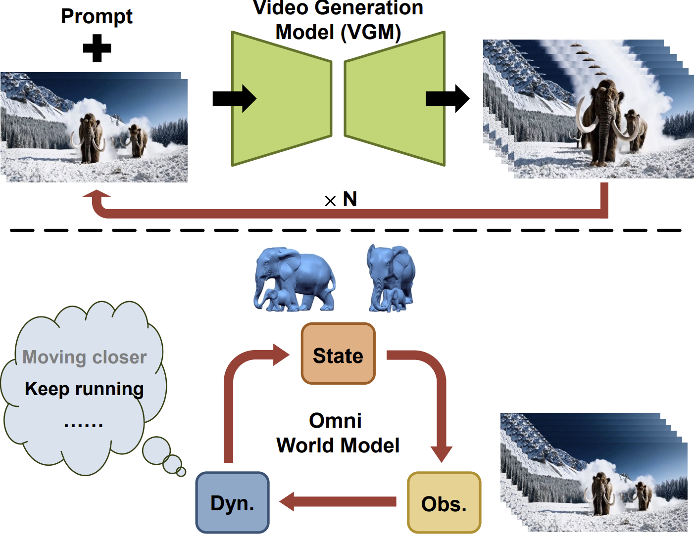
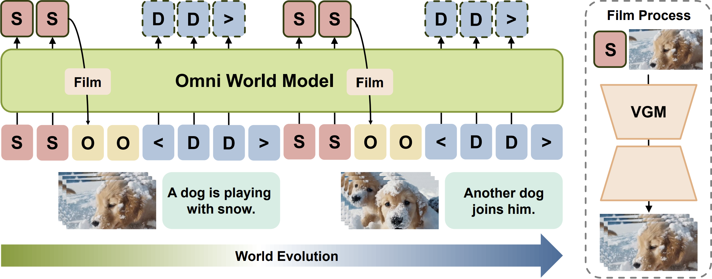

# Owl-1: Omni World Model for Consistent Long Video Generation
### [Paper](https://arxiv.org/abs/2412.09600)

> Owl-1: Omni World Model for Consistent Long Video Generation

> [Yuanhui Huang](https://scholar.google.com/citations?hl=zh-CN&user=LKVgsk4AAAAJ), [Wenzhao Zheng](https://wzzheng.net/)$\dagger$, Yuan Gao, Xin Tao, Pengfei Wan, Di Zhang, [Jie Zhou](https://scholar.google.com/citations?user=6a79aPwAAAAJ&hl=en&authuser=1), [Jiwen Lu](http://ivg.au.tsinghua.edu.cn/Jiwen_Lu/)

$\dagger$ Project leader

Owl-1 approaches consistent long video generation with an **omni world model**, which models the evolution of the underlying world with latent state, explicit observation and world dynamics variables.


## News.
- **[2024/12/14]** Paper released on [arXiv](https://arxiv.org/abs/2412.09600).
- **[2024/12/14]** Demo release.

## Demo

### Short Videos


### Long Videos


## Overview
<p align = "center"> 

</p>

We propose an Omni World modeL (Owl-1) to produce long-term coherent and comprehensive conditions for consistent long video generation. 
As videos are observations of the underlying evolving world, we propose to model the long-term developments in a latent space and use VGMs to film them into videos.
Specifically, we represent the world with a latent state variable which can be decoded into explicit video observations.
These observations serve as a basis for anticipating temporal dynamics which in turn update the state variable.
The interaction between evolving dynamics and persistent state enhances the diversity and consistency of the long videos.
Extensive experiments show that Owl-1 achieves comparable performance with SOTA methods on VBench-I2V and VBench-Long, validating its ability to generate high-quality video observations.




## Getting Started
We will release the code soon.

## Citation

If you find this project helpful, please consider citing the following paper:
```
@article{huang2024owl1omniworldmodel,
    title={Owl-1: Omni World Model for Consistent Long Video Generation}, 
    author={Huang, Yuanhui and Zheng, Wenzhao and Gao, Yuan and Tao, Xin and Wan, Pengfei and Zhang, Di and Zhou, Jie and Lu, Jiwen},
    journal={arXiv preprint arXiv:2412.09600},
    year={2024},
}
```